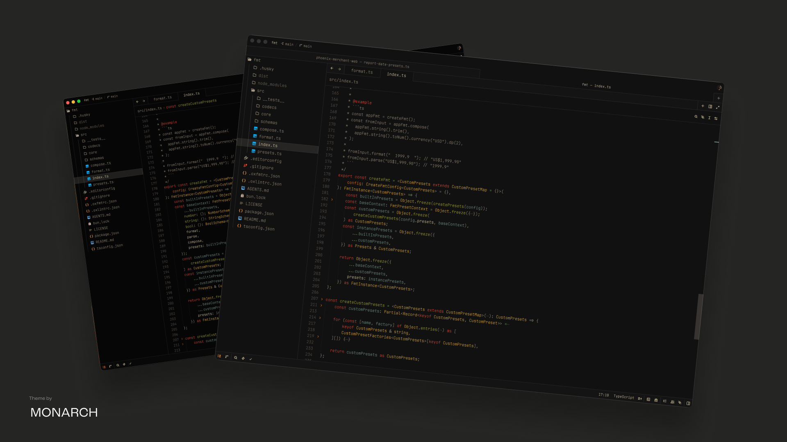

# Charbox Theme

A darker, high-contrast, Gruvbox-inspired theme for Zed.

## Themes included

- Charbox
- Charbox midnight
- Charbox midnight alt

## Local development install

1. Open Zed.
2. Open Extensions with `cmd-shift-x` on macOS or `ctrl-shift-x` on Linux/Windows.
3. Click **Install Dev Extension**, or run `zed: install dev extension` from the command palette.
4. Select this repository folder, the one containing `extension.toml`.
5. Open the theme selector with `cmd-k cmd-t` / `ctrl-k ctrl-t` and select a Charbox variant.

## Development

Theme styles live in `themes/charbox.json`. After editing theme values, reload the dev extension in Zed if changes do not appear immediately.

## License

Charbox is released under the MIT License. See `LICENSE` and `NOTICE.md`.
